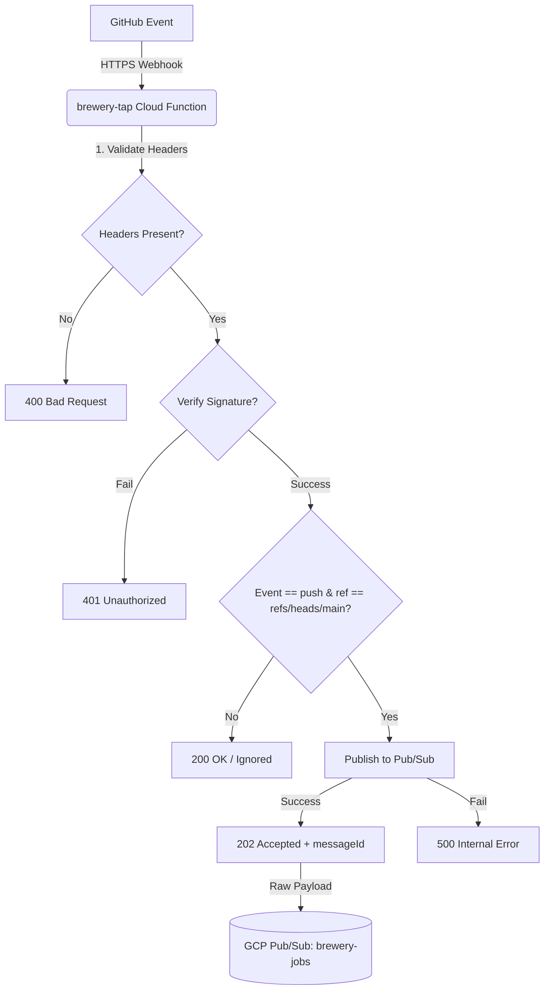

# 🍺 Brewery Tap

`brewery-tap` is a serverless GitHub App Webhook Proxy designed to connect GitHub repository push events to your internal build systems securely and efficiently. It runs as a **Google Cloud Function (Gen 2)**, acting as a bridge ("tap") that listens for webhook notifications, validates their signatures, filters for updates to the `main` branch, and forwards the payload to a **GCP Pub/Sub** topic.

---

## 🛠️ System Architecture & Webhook Flow

Below is the execution flow of an incoming event through the `brewery-tap` proxy:



---

## 🚀 Local Development

To test the proxy locally without deploying resources to Google Cloud, you can run the server locally against a **GCP Pub/Sub Emulator**.

### 1. Prerequisites
- **Node.js** (v18 or higher recommended; tested up to v24)
- **gcloud CLI** (Google Cloud SDK) for running the emulator
- **ngrok** or a similar reverse proxy for exposing your local server to GitHub

### 2. Setup the Environment
Clone the repository and install all dependencies:
```bash
git clone https://github.com/your-org/brewery-tap.git
cd brewery-tap
npm install
```

Create a `.env` file in the root directory:
```env
PORT=8080
GCP_PROJECT_ID=brewery-homelab
PUBSUB_TOPIC_NAME=brewery-jobs
GITHUB_WEBHOOK_SECRET=your_github_webhook_secret_here
PUBSUB_EMULATOR_HOST=localhost:8085
```

### 3. Start the Pub/Sub Emulator
Start the local Google Cloud Pub/Sub emulator in a separate terminal:
```bash
gcloud beta emulators pubsub start --host-port=localhost:8085
```

Before sending events, you must create the Pub/Sub topic in the emulator. You can run a quick initialization script or use `curl` against the emulator:
```bash
curl -X PUT http://localhost:8085/v1/projects/brewery-homelab/topics/brewery-jobs
```

### 4. Run the Local Server
Start the Cloud Functions Framework local server:
```bash
npm start
```
The server will start listening on port `8080` (or the `PORT` specified in `.env`).

### 5. Run the Test Suite
You can execute the automated unit test suite locally to verify code correctness and signature verification:
```bash
npm test
```

### 6. Testing Webhooks Locally
To test with real webhooks from GitHub:
1. Start an `ngrok` tunnel:
   ```bash
   ngrok http 8080
   ```
2. Copy the forwarding URL (e.g., `https://xxxx.ngrok-free.app`).
3. Set this URL as the webhook URL in your GitHub App settings.
4. Send a mock payload locally to test response logic:
   ```bash
   # Example: Sending a ping event
   curl -X POST http://localhost:8080 \
     -H "X-GitHub-Event: ping" \
     -H "Content-Type: application/json" \
     -d '{"zen": "Design for simplicity."}'
   ```

---

## 🌐 Production Deployment (Google Cloud Functions)

For production environments, deploying the proxy to **Google Cloud Functions (Gen 2)** is highly recommended. It offers automatic scaling, low latency, and integrates seamlessly with Google's security infrastructure.

### Option A: Standard Deployment (Environment Variables)
If you wish to pass your webhook secret directly as an environment variable (simplest approach):

```bash
gcloud functions deploy brewery-tap \
  --gen2 \
  --runtime=nodejs20 \
  --region=us-central1 \
  --trigger-http \
  --allow-unauthenticated \
  --entry-point=breweryWebhook \
  --set-env-vars GCP_PROJECT_ID=your-gcp-project-id,PUBSUB_TOPIC_NAME=brewery-jobs,GITHUB_WEBHOOK_SECRET=your_production_webhook_secret
```

> [!WARNING]
> Setting secrets directly in environment variables via CLI flags can leak the secrets in your shell history and make them visible to anyone with read access to the Cloud Function configuration.

---

### Option B: Secure Deployment (GCP Secret Manager)
For production environments, it is best practice to store sensitive secrets in **GCP Secret Manager** and inject them securely into the Cloud Function at runtime.

#### 1. Create the Secret in Secret Manager
Store your GitHub Webhook Secret in Secret Manager:
```bash
# Create the secret container
gcloud secrets create GITHUB_WEBHOOK_SECRET --replication-policy="automatic"

# Add your secret value
echo -n "your_production_webhook_secret" | gcloud secrets versions add GITHUB_WEBHOOK_SECRET --data-file=-
```

#### 2. Grant Access Permissions
Ensure your Cloud Function's runtime Service Account has access to read the secret:
```bash
# Grant access to the secret
gcloud secrets add-iam-policy-binding GITHUB_WEBHOOK_SECRET \
  --member="serviceAccount:YOUR_PROJECT_NUMBER-compute@developer.gserviceaccount.com" \
  --role="roles/secretmanager.secretAccessor"
```
*(Replace `YOUR_PROJECT_NUMBER` with your actual Google Cloud Project Number).*

#### 3. Deploy the Function Referencing Secret Manager
Deploy the function and specify that the `GITHUB_WEBHOOK_SECRET` environment variable should be populated from Secret Manager:

```bash
gcloud functions deploy brewery-tap \
  --gen2 \
  --runtime=nodejs20 \
  --region=us-central1 \
  --trigger-http \
  --allow-unauthenticated \
  --entry-point=breweryWebhook \
  --set-env-vars GCP_PROJECT_ID=your-gcp-project-id,PUBSUB_TOPIC_NAME=brewery-jobs \
  --set-secrets=GITHUB_WEBHOOK_SECRET=GITHUB_WEBHOOK_SECRET:latest
```

---

## 🛠️ GitHub App Configuration

1. **Webhook URL**: Set the webhook URL to the **HTTPS Trigger URL** provided by the `gcloud functions deploy` command (e.g., `https://brewery-tap-xxxx-uc.a.run.app`).
2. **Webhook secret**: Enter the exact secret string that you stored in your environment or Secret Manager.
3. **Repository Permissions**:
   - `Contents`: **Read-only**
   - `Metadata`: **Read-only**
   - `Commit statuses`: **Read & write**
4. **Subscribe to Events**:
   - Select **Push** events.
5. **Activation**: Enable the **Active** checkbox and save.